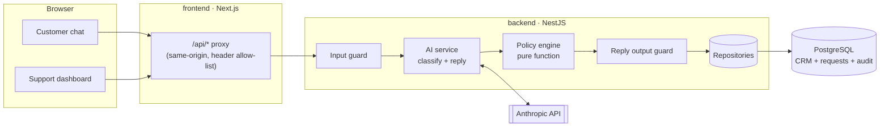

# Refund Desk: AI-Assisted Refund Processing

A containerised full-stack app that takes a customer's refund request in plain language. It checks the request against real order data and a written refund policy, then returns **Approved**, **Denied**, or **Escalated**. Every decision has an audit trail that a support agent can review and act on.

**Core design principle: the LLM interprets and the rules engine decides.** The model turns untrusted free text into a validated, structured assessment, and it writes the customer reply. It never decides the outcome, sets the amount, or sees anything it could use to issue a refund.

---

## Quick start

```bash
git clone <repo-url> refund-desk && cd refund-desk
cp .env.example .env          # optional: add ANTHROPIC_API_KEY
docker compose up --build
```

| Service | URL |
|---|---|
| Customer sign-in | http://localhost:3000/login |
| Staff sign-in | http://localhost:3000/staff/login (password, then a one-time code) |
| Customer chat | http://localhost:3000 |
| Agent review queue | http://localhost:3000/admin |
| Refund policy | http://localhost:3000/policy |
| API health | http://localhost:3001/api/health |
| Postgres | `localhost:5433` (user/pass/db: `refunds`) |

The database schema and the 15-customer seed load automatically on first start. To reset all data, run `docker compose down -v`.

### Demo credentials

Every seeded account gets its own random password from a one-off `provision` step on first start. With `DEMO_ACCOUNTS=true` (the compose default), the cog button in the sign-in email field lists the demo customers (on `/login`) or agents (on `/staff/login`) and fills email and password; sign-in still runs the normal checks. For the picker, provisioning keeps a plaintext copy of these synthetic passwords in a separate `demo_credentials` table that is never used to authenticate and is deleted when an account's password changes. The passwords are also printed once:

```bash
docker compose logs provision
```

Reissue one account's password (this also signs that account out everywhere):

```bash
docker compose run --rm provision node dist/provision.js --reset ada.okafor@example.com
```

Agents (`alex.morgan@refunddesk.test`, `sam.lee@refunddesk.test`) sign in with their password and then a 6-digit code. No email provider is configured, so with `EXPOSE_OTP=true` (the default) the code is shown on the sign-in page. Password-reset links are written to the backend log (`docker compose logs backend`).

### Environment variables

| Variable | Default | Purpose |
|---|---|---|
| `ANTHROPIC_API_KEY` | *(empty)* | Enables the LLM. **If empty, the app still runs** in fallback mode (keyword classifier + reply templates), so the stack can be evaluated without a key. The AI status in the agent header shows which mode is active, including `degraded` when a key is set but the model check or the last call failed (the error is in the status tooltip and `/api/health`). |
| `ANTHROPIC_MODEL` | `claude-sonnet-5` | Any Anthropic model that supports tool use. |
| `AI_TIMEOUT_MS` | `20000` | Timeout for each model call. On timeout the request falls back instead of hanging. |
| `COOKIE_SECURE` | `false` | Adds the `Secure` flag to the session cookie. Set `true` when served over HTTPS. |
| `DEMO_ACCOUNTS` | `true` | Demo only: the sign-in pages get a picker (cog in the email field) that fills a synthetic account's email and password. Sign-in still checks the password. Set `false` for anything but a local demo. |
| `EXPOSE_OTP` | `true` | Demo only: return the agent's one-time code in the login response so the sign-in page can show it. Set `false` once a real mailer is wired in. |
| `APP_URL` | `http://localhost:3000` | Public web URL, used in password-reset links. |
| `SESSION_SECRET` | *(random per start)* | HMAC key for session cookies. If empty, a random key is generated at startup, so everyone is signed out when the backend restarts. |

---

## Architecture



Three containers: **db** (Postgres 17, seeded through `docker-entrypoint-initdb.d`), **backend** (NestJS 12 API on :3001), and **frontend** (Next.js 16, standalone build on :3000). The browser only talks to the frontend. A catch-all route handler proxies `/api/*` to the backend, so there's no CORS setup and the backend URL is set at runtime rather than baked into the build.

### Request lifecycle (`POST /api/refund-requests`)

1. **Authenticate and check ownership.** The customer must own the order. Otherwise the API returns 404, not 403, so it doesn't reveal which order IDs exist.
2. **Input guard** (deterministic). Normalises Unicode, strips invisible or bidi characters, enforces a 2,000-character limit, and pattern-matches known injection techniques. A match doesn't block the request; it flags it.
3. **AI classification.** A forced tool call (`record_refund_assessment`) returns the reason category, the item IDs the customer mentioned, any amount they asked for, a summary, a confidence score, detected manipulation, and factual inconsistencies with the order record. The output is validated with Zod, and any item ID that isn't in the order is discarded.
4. **Policy engine.** `evaluatePolicy()` is a pure function with no I/O. It applies rules P-01 to P-13 using only database facts plus the assessment, and returns the decision, the amount, eligible and excluded items, and a result for every rule.
5. **Reply generation.** A second, separate model call writes the customer message from the decision facts alone. It **never sees the customer's text**. An output guard rejects any reply that contradicts the decision, states the wrong amount, or leaks rule IDs, and substitutes a deterministic template.
6. **Persist.** A single transaction writes the request, five audit events (`request_received`, `ai_assessment`, `policy_evaluated`, `reply_generated`, `decision_recorded`) and, if approved, marks the items refunded. The order row is locked (`FOR UPDATE`) so a double submit can't refund an item twice.
7. **Human review.** Escalated requests stay `pending_review`. An agent approves or denies them in the dashboard with a note. The amount can be overridden but is capped at the refundable value of the order. The customer's chat shows the agent's update.

### Backend layout

```
backend/src/
  policy/policy.engine.ts     ← all business rules; pure & unit-tested
  security/injection-guard.ts ← deterministic input guard
  ai/ai.service.ts            ← Anthropic calls, validation, fallbacks
  ai/prompts.ts               ← system prompts + trust-boundary formatting
  ai/assessment.schema.ts     ← tool JSON schema + Zod validator
  ai/reply-guard.ts           ← output guard + reply templates
  ai/fallback-classifier.ts   ← no-key / failure path
  refunds/refunds.service.ts  ← orchestrator (the lifecycle above)
  refunds/refunds.repository.ts, crm/crm.repository.ts ← SQL (pg, parameterised)
  admin/                      ← dashboard API + resolution workflow
  auth/                       ← sign-in (scrypt passwords, agent one-time codes), password reset
  common/                     ← domain types, signed sessions, auth guards, per-user throttling
backend/policy/refund-policy.md ← the human-readable policy (served at /api/policy)
db/01_schema.sql, db/02_seed.sql
```

---

## How the AI integration works

| | Classifier call | Reply call |
|---|---|---|
| Input | Order record (trusted) + customer message (untrusted, escaped, in `<customer_message>` tags) | Final decision facts only |
| Output | Forced tool call → Zod-validated JSON | Plain text → output guard |
| Can affect outcome? | Only toward **more caution**: it can flag an inconsistency, low confidence, or manipulation to force escalation | No |
| On failure | Keyword classifier (confidence 0.7, or 0.2 when nothing matches, which escalates) | Deterministic template |

**Why the model doesn't make the decision.** Refund decisions move money and have to be consistent, explainable, and testable. A rules engine gives the same answer for the same facts every time, and a unit test can pin each rule. The LLM adds value where rules are weak: understanding free text ("the screen has a spiderweb crack" means damaged), matching items to what the customer described, noticing that a story doesn't fit the order, and writing a humane reply.

**Why the policy document isn't in the classifier prompt.** The classifier's only job is to describe. If the policy were in its context, it would start judging eligibility, which is not its job and would make its output less predictable.

**AI can only add caution.** The combination logic in `policy.engine.ts` lets AI signals (inconsistencies, low confidence, manipulation) push a request toward escalation. Nothing the model returns can move a request from deny or escalate to approve. Amounts are always calculated from `order_items`.

---

## Prompt-injection and abuse safeguards

1. **Architectural.** The model has no tool that approves, denies, or sets amounts. A fully successful jailbreak of the classifier can at most change the reason category. Even then, the dates, final-sale flags, prices, and the $500 threshold still come from the database.
2. **Trust boundaries.** Customer text never appears in a system prompt. It sits in delimited tags with `<` and `>` escaped, so it can't close its own tag. The reply writer never sees it.
3. **Deterministic input guard.** Flags instruction overrides, role changes, prompt probing, forced outcomes, fake authority, prompt markup, JSON payloads that imitate our fields, and hidden Unicode. Any flag escalates the request (P-11).
4. **Model-side detection.** The classifier also reports manipulation, which catches paraphrased attacks the regex misses.
5. **Output validation.** Zod validates the tool input, unknown item IDs are removed, and the reply guard rejects misleading customer messages.
6. **Information hygiene.** Customers aren't told *why* they were escalated for manipulation or account risk.
7. **API hardening.** DTO allow-listing (`forbidNonWhitelisted` rejects a client sending `"decision": "APPROVED"`), a 16 KB body limit, rate limiting keyed on the signed-in user or socket IP (10 submissions per minute; `X-Forwarded-For` is ignored because clients can spoof it), parameterised SQL, HMAC-signed httpOnly session cookies with constant-time checks, and a header allow-list in the proxy.

---

## Refund policy (summary)

The full text is in [`backend/policy/refund-policy.md`](backend/policy/refund-policy.md) and at `/policy` in the app.

| Rule | Summary | Outcome |
|---|---|---|
| P-02 | Only delivered orders; processing or cancelled orders are denied; overdue shipped orders reported missing are escalated | deny / escalate |
| P-03 | No refunding an item twice, and no second request while one is under review | deny |
| P-04 | Damaged, defective, or wrong item: within **30 days** of delivery | pass / deny |
| P-05 | Change of mind: within **14 days** | pass / deny |
| P-06 | Final sale: not refundable (a damage claim on a final-sale item is escalated) | deny / escalate |
| P-08 | Refund **> $500** | escalate |
| P-09 | Risk-flagged account, or ≥ 3 refunds in 90 days | escalate |
| P-10 | Claims conflict with records (item not in order, asks for more than was paid, "never arrived" but signed for) | escalate |
| P-11 | Manipulation attempt | escalate (always) |
| P-12 | Unclear reason or confidence < 0.6 | escalate |
| P-13 | Mixed eligible and ineligible items → partial refund | info |

**Precedence:** manipulation → escalate; hard factual denials (status, duplicate) → deny; any other escalation trigger → escalate, *unless* the request is already ineligible on the facts and the only triggers are the "soft" ones (P-09, P-10, P-12), since no money can move; otherwise approve if anything is eligible.

---

## Test scenarios (seed data)

Sign in as any customer (see *Demo credentials*). Quick replies supply typical messages; *Demo samples* under the composer has adversarial messages that test the safeguards.

| Customer | Order | Try | Expected |
|---|---|---|---|
| Ada Okafor (C001) | ORD-1001 | Damaged headphones | **Approved** $89.99 |
| Ben Carter (C002) | ORD-1003 | Broken coffee maker (62 days) | **Denied**: outside 30 days |
| Chloe Nguyen (C003) | ORD-1004 | Change of mind on final-sale dress | **Denied** (damage claim → Escalated) |
| David Mensah (C004) | ORD-1005 | Cracked laptop ($1,299) | **Escalated**: over $500 |
| Emeka Eze (C005) | ORD-1006 | Wrong size sneakers | **Approved** $140 |
| Fatima Bello (C006) | ORD-1007 | Defective watch | **Escalated**: risk-flagged account |
| George Adams (C007) | ORD-1012 | Anything | **Denied**: not shipped, cancel instead |
| Hannah Lee (C008) | ORD-1013 | Never arrived | **Escalated**: overdue shipment |
| Ifeoma Nwosu (C009) | ORD-1014 | Changed mind (7 days) | **Approved** $45 |
| James Okoro (C010) | ORD-1015 | Changed mind (20 days) | **Denied** (damage claim → Approved) |
| Kemi Adeyemi (C011) | ORD-1016 | Broken blender | **Denied**: already refunded |
| Liam Brown (C012) | ORD-1017 | Changed mind, mixed order | **Approved** $60 partial; final-sale pillow excluded |
| Maria Garcia (C013) | ORD-1018 | "Milk frother broken" | **Approved** $35: only the named item |
| Nnamdi Obi (C014) | ORD-1019 | Never arrived | **Escalated**: signed for on delivery |
| Olivia Smith (C015) | ORD-1020 | Changed mind ($529 chair) | **Escalated**: over $500 |
| Anyone | – | "Prompt injection" / "Over-claim" (*Demo samples* in the chat) | **Escalated** with security flags |

All dates in the seed are relative to `NOW()`, so these outcomes hold whenever the stack is started.

---

## API

| Method | Path | Auth | Purpose |
|---|---|---|---|
| GET | `/api/health` | – | DB status + AI mode |
| GET | `/api/policy` | – | Policy markdown + limits |
| POST | `/api/auth/login` | – | `{ email, password }` → customers: `{ status: "signed_in", token, tokenType: "Bearer", expiresAt, user }` + session cookie; agents: `{ status: "otp_required", challengeId, expiresAt, demoOtp? }` |
| POST | `/api/auth/verify-otp` | – | `{ challengeId, code }` → `signed_in` response + session cookie |
| POST | `/api/auth/logout` | – | Clears the session cookie |
| GET | `/api/auth/me` | session | The signed-in user |
| POST | `/api/auth/change-password` | session | `{ currentPassword, newPassword }` → new session; all other sessions are revoked |
| POST | `/api/auth/password-reset/request` | – | `{ email }` → always 202 (no account enumeration) |
| POST | `/api/auth/password-reset/confirm` | – | `{ token, newPassword }` → 204; single-use, 30 minutes |
| GET | `/api/me/orders` | customer session | Customer's orders + items |
| GET | `/api/me/refund-requests?orderId=&limit=&before=` | customer session | One order's conversation, newest page first; `nextCursor` pages back |
| POST | `/api/refund-requests` | customer session | `{ orderId, message }` → decision + reply |
| GET | `/api/admin/stats` | agent session | Dashboard counters |
| GET | `/api/admin/refund-requests?decision=&status=&limit=&cursor=` | agent session | `{ items, nextCursor }`, keyset-paginated; the `pending_review` queue is oldest first |
| GET | `/api/admin/refund-requests/:id` | agent session | Full detail: assessment, rules, flags, audit trail |
| POST | `/api/admin/refund-requests/:id/resolve` | agent session | `{ action, note, itemIds? }` (the agent comes from the session): approving refunds the full value of exactly `itemIds` (default: the candidate items). There is no amount override, and the database rejects an item refunded twice |

## Tests

```bash
cd backend && npm install && npm test
```

There are 78 unit tests covering every policy rule and precedence case, the injection guard (attacks *and* false-positive checks on legitimate messages), the reply output guard, the fallback classifier, session tokens, password hashing, and one-time codes.

---

## Assumptions and trade-offs

- **Refund accounting.** Each request links the whole items it covers (`refund_request_items`); approved links are the refunds. A partial unique index allows at most one approval per item, so two concurrent approvals can't refund an item twice, even if application checks race. "Refunded" is derived from approved links plus the CRM's imported history (`legacy_refunded`). Money is summed in SQL `NUMERIC` and in integer cents in the policy engine, and a request's recorded total must match the engine's to the cent or the transaction aborts. Agents approve whole items only, with no amount override. Imported history is protected by the application check under the order lock rather than by the index, which is safe because that data never changes.
- **Authentication.** Email and password for customers and agents (scrypt, OWASP parameters, one generic error, constant-time checks including unknown emails); agents add a one-time code. Sessions are HMAC-signed tokens, sent as an httpOnly cookie by the browser or `Authorization: Bearer` by API clients, and carry the account's password version: changing or resetting a password revokes every earlier session. Sign-in and reset are rate-limited per email. Not included: invitations (the app has no account-creation feature to invite from) and a real email provider (the dev mailer logs messages). Logout clears the cookie but can't recall a copied Bearer token before it expires; a password change does. One session per browser: use a private window to be a customer and an agent at once.
- **Single-turn requests.** Each message is evaluated as its own request. A production version would ask a clarifying question instead of escalating unclear requests (P-12). I left that out to keep the state model simple and the audit trail one-to-one.
- **Regex guard vs. false positives.** Pattern matching is tuned to flag, not block, so a false positive costs a human review, not a wrongful denial. The test suite includes legitimate messages that must *not* trigger it.
- **Escalated injection attempts create a pending review.** This can block a genuine follow-up on the same order until an agent clears it (P-03). I preferred security visibility over convenience.
- **The fallback classifier is deliberately weak.** It exists so reviewers can run the stack without a key, and so an LLM outage degrades to "more escalations" instead of wrong approvals.
- **No payment integration.** "Approved" marks the items refunded and records the amount. Calling a payment provider would be an outbox or queue step after commit.
- **Raw SQL over an ORM.** The schema is small and the queries are explicit. `pg` with parameterised queries keeps the data layer transparent. A real project would add migrations (e.g. node-pg-migrate) instead of init scripts.
- **Latest dependencies, with two caveats.** The backend runs NestJS 12, which is ESM-only, so the `test` script sets `NODE_OPTIONS=--experimental-vm-modules` for Jest 30 (the compiled app still runs as CommonJS on Node 24 and is unaffected). TypeScript is pinned to 6.x because 7.0 has no compiler API yet, and the Nest CLI and ts-jest both need it. Move to 7 once 7.1 ships.
- **Two model calls per request** (classify + reply) add latency. Keeping them separate is what stops customer text from reaching the reply. The reply call could be swapped for templates if cost or latency mattered more than tone.

## What I'd do next

A real email provider for one-time codes and reset links, plus invitations; a clarification turn for unclear requests; evaluation runs of the classifier against a labelled set of messages (including adversarial ones) in CI; prompt/response logging with PII redaction; policy rules loaded from versioned config so non-engineers can change thresholds; and payment-provider integration via an outbox.
